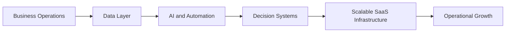

# Sefa Toprak

<p align="center">
  
</p>

<p align="center">
  <a href="LINKEDIN_URL">
    
  </a>
  <a href="mailto:EMAIL_ADDRESS">
    
  </a>
  <a href="https://github.com/GITHUB_USERNAME">
    
  </a>
</p>

<p align="center">
  
</p>

---

## ▍Position

**Solvena** builds AI-powered, scalable software infrastructures that help businesses manage their entire operations through a single intelligent system.

My focus is to design and build systems that simplify complex business workflows, improve operational efficiency, and support sustainable growth.

---

## ▍Areas of Work

```txt
SaaS Platforms
AI-Powered Operational Systems
CRM / ERP Infrastructure
Decision-Oriented Software
Automation Architectures
Scalable Backend Systems
```

---

## ▍Approach

<p align="center">
  
  
  
  
</p>

- Translating business needs into technical architecture
- Placing data at the center of decision-making
- Reducing repetitive operational work through automation
- Building sustainable infrastructures ready for growth
- Keeping user experiences simple, fast, and functional

---

## ▍Technology Focus

<p align="center">
  
</p>

---

## ▍System Perspective



---

## ▍GitHub

<p align="center">
  
  
</p>

<p align="center">
  
</p>

---

## ▍Solvena Standard

> Simple interfaces. Powerful infrastructures. Measurable outcomes.

At Solvena, software is not just working code. It is a system that accelerates business rhythm, improves decision quality, and carries scalable growth.

---

<p align="center">
  
</p>
